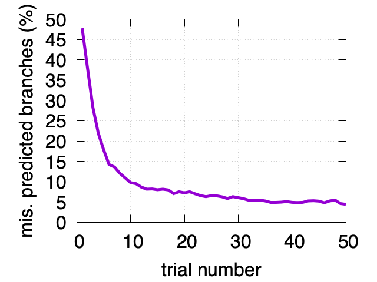

## Parsing JSON Really Quickly : Lessons Learned
:rocket: :rocket: :rocket: :rocket: :rocket: :rocket: 

Daniel Lemire 
blog: https://lemire.me 
twitter: [@lemire](https://twitter.com/lemire)
GitHub: [https://github.com/lemire/](https://github.com/lemire/)

professor (Computer Science) at Université du Québec (TÉLUQ)
Montreal :canada: :cocktail: :beer:

---

## How fast can you read a large file?

- Are you limited by your disk or
- Are you limited by your CPU?

---
## An iMac disk: 2.2 GB/s


[Faster SSDs (e.g., 5 GB/s) are available](https://www.anandtech.com/show/14960/team-group-joins-pcie-40-ssd-race-with-cardea-zero-z440-drives): PCIe 4.0, 5.0, 6.0... 

---
## Reading text lines (CPU only)

###~0.6 GB/s on 3.4 GHz Skylake 
in Java

```java
void parseLine(String s) {
  volume += s.length();
}

void readString(StringReader data) {				
  BufferedReader bf = new BufferedReader(data);
  bf.lines().forEach(s -> parseLine(s));
}
```

[Source available.](https://github.com/lemire/Code-used-on-Daniel-Lemire-s-blog/tree/master/2019/07/26)
Improved by [JDK-8229022](https://bugs.openjdk.java.net/browse/JDK-8229022)


---
## Reading text lines (CPU only)

###~1.5 GB/s on 3.4 GHz Skylake 
in C++ (GNU GCC 8.3)

```C++
size_t sum_line_lengths(char * data, size_t length) {
   std::stringstream is;
   is.rdbuf()->pubsetbuf(data, length);
   std::string line;
   size_t sumofalllinelengths{0};

   while(getline(is, line)) {
     sumofalllinelengths += line.size();
   }

   return sumofalllinelengths;
}
```

[Source available.](https://github.com/lemire/simdjson/pull/344/files)


---

Even standard C++ `getline` cannot keep up with a fast disk while reading large files!

Need to uses multiple cores?

---


[source](https://www.nextbigfuture.com/2019/02/the-end-of-moores-law-in-detail-and-starting-a-new-golden-age.html)

---

## JSON 

- Specified by Douglas Crockford 
- [RFC 7159](https://tools.ietf.org/html/rfc8259) by Tim Bray in 2013
- Ubiquitous format to exchange data

```javascript
{"Image": {"Width":  800,"Height": 600,
"Title":  "View from 15th Floor",
"Thumbnail": {
    "Url":    "http://www.example.com/81989943",
    "Height": 125,"Width":  100}
} 
```        

---

- "Our backend spends half its time serializing and deserializing json"

---


## JSON  parsing

- Read all of the content
- Check that it is valid JSON
- Check Unicode encoding
- Parse numbers
- Build DOM (document-object-model)

Harder than parsing lines?

---

## Jackson JSON speed (Java)

twitter.json: **0.350 GB/s** on  3.4 GHz Skylake

[Source code available.](https://github.com/lemire/jackson-json-bench)


|         | speed  |
| ------------- |:-------------:
| Jackson   (Java)  | 0.35 GB/s |
| readLines C++      | 1.5 GB/s |
| disk     |    2.2 GB/s |

---


## RapidJSON speed (C++)

twitter.json: **0.650 GB/s** on  3.4 GHz Skylake


|         | speed  |
| ------------- |:-------------:
| RapidJSON (C++)     | 0.650 GB/s |
| Jackson   (Java)  | 0.35 GB/s |
| readLines C++      | 1.5 GB/s |
| disk     |    2.2 GB/s |

---

## simdjson speed (C++)

twitter.json: **2.6 GB/s** on  3.4 GHz Skylake

|         | speed  |
| ------------- |:-------------:
| simdjson (C++)     | 2.6 GB/s |
| RapidJSON (C++)     | 0.650 GB/s |
| Jackson   (Java)  | 0.35 GB/s |
| readLines C++      | 1.5 GB/s |
| disk     |    2.2 GB/s |

---

2.6 GB/s on a 3.4 GHz (4 GHz turbo) processor is

~1.5 cycles per input byte

---

## Trick #1 : avoid hard-to-predict branches

---

Write random numbers on an array.

```java
while (howmany != 0) {
    out[index] =  random();
    index += 1;
    howmany--;
}
```
e.g., ~ 3 cycles per iteration

---

Write only odd random numbers:

```java
while (howmany != 0) {
    val = random();
    if( val is odd) { // <=== new
      out[index] =  val;
      index += 1;
    }
    howmany--;
}
```

---

From 3 cycles to 15 cycles per value !

---

## Go branchless young man!

``` java
while (howmany != 0) {
    val = random();
    out[index] = val;
    index += (val bitand 1);
    howmany--;
}
````

back to under 4 cycles!

[Details and code available](https://lemire.me/blog/2019/10/15/mispredicted-branches-can-multiply-your-running-times/)

---

## What if I keep running the same benchmark?

(same pseudo-random integers from run-to-run)



---

use vector instructions

histo

autobus

---

show how we can detect escape sequences and the inside of quotes


c++ but wrapper in python, c#, rust, javascript ruby

ports to rust and c#

be obsessive 
plot performance per commit


do not microbenchmark branchy code

counting instruction retired is not a bad metric, and it more objective given deterministic code

use machine learning to build hardware specific models and gain better understanding 


parsing numbers is tricky and expensive 

review simd: not just for crunching numbers
review arm neon, sse, avx

discuss vector classification 


utf8 validation

finite state machine (avoids branches)
simd

processing random UTF-8

|         |  cycles/char |
| ------------- |:-------------:
| finite-state machine (C++)     | 11  |
| simdjson    | 0.5 |

20 x faster!

runtime dispatching works but is surprisingly tricky

use function pointer.
On first call, pointer checks CPU, and reassigns itself to best function
must be thread safe
no support in language


https://github.com/lemire/fastvalidate-utf-8

the challenge with high level languages

do not allocate thousands of tiny objects: use a memory block

architecture: stage 1 and stage 2, not a matter of skipping white spaces... stage 1 works over 64 bytes


not independent costs

---

## Reference


- Geoff Langdale, Daniel Lemire, Parsing Gigabytes of JSON per Second,  VLDB Journal, https://arxiv.org/abs/1902.08318

- GitHub: [https://github.com/lemire/simdjson/](https://github.com/lemire/simdjson/)

---

## Credit


Geoff Langdale (algorithmic architect and wizard)

Special thanks to:

Thomas Navennec, Kai Wolf, Tyler Kennedy, Frank Wessels, George Fotopoulos, Heinz N. Gies, Emil Gedda, Wojciech Muła, Georgios Floros, Dong Xie, Nan Xiao, Egor Bogatov, Jinxi Wang, Luiz Fernando Peres, Wouter Bolsterlee, Anish Karandikar, Reini Urban. Tom Dyson, Ihor Dotsenko, Alexey Milovidov, Chang Liu, Sunny Gleason, John Keiser, Zach Bjornson, Vitaly Baranov, Juho Lauri, Michael Eisel, Io Daza Dillon, Paul Dreik and others

---
