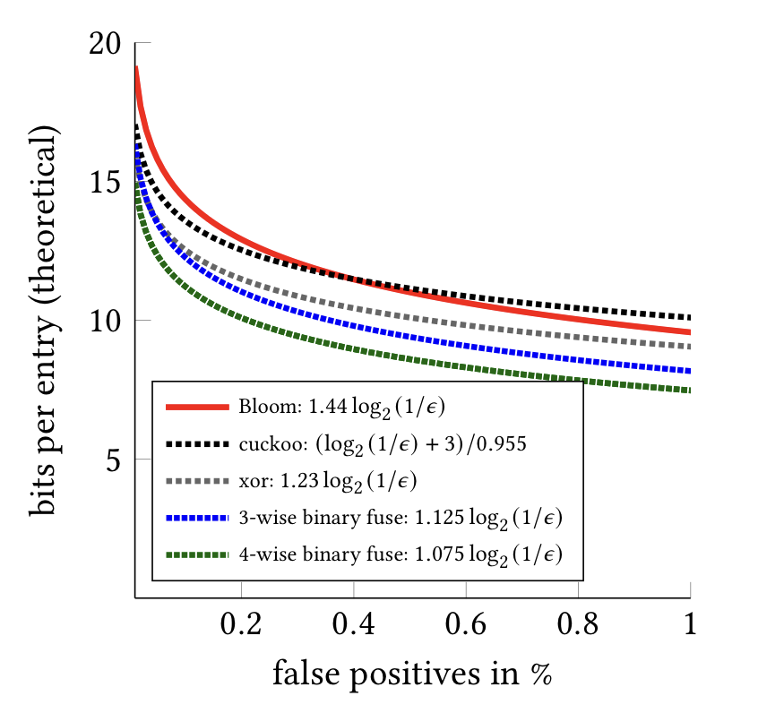
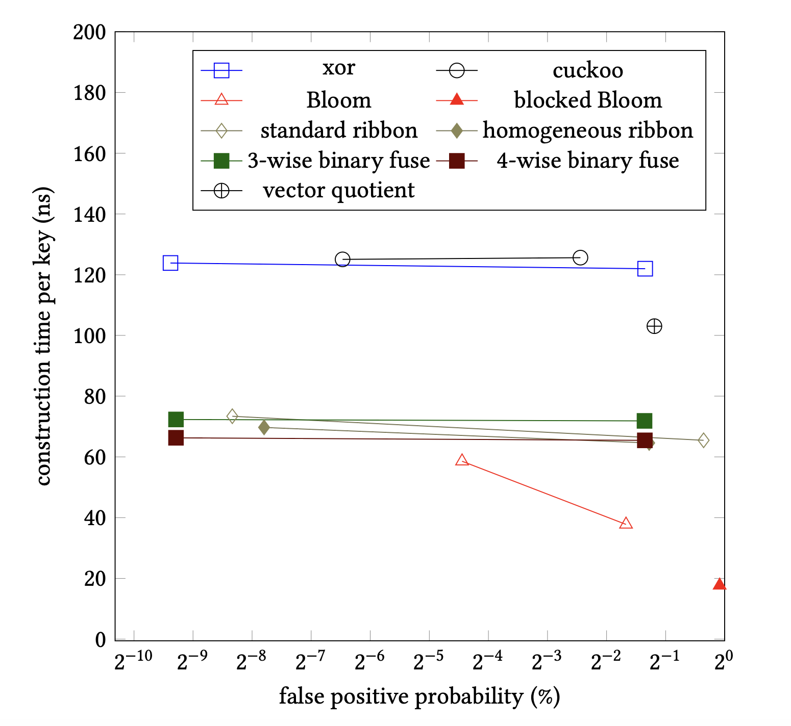

<!-- -->

<!--  --- -->

## <!--fit--> Binary Fuse Filters: Fast and Tiny Immutable Filters


Daniel Lemire 
professor, Data Science Research Center
Université du Québec (TÉLUQ)
Montreal 

blog: https://lemire.me 
twitter: [@lemire](https://twitter.com/lemire)
GitHub: [https://github.com/lemire/](https://github.com/lemire/)


---

# Theoretical bound

- Given $N$ elements in the set
- Spend $k$ bits per element
- Get a false positive rate of $1/2^k$


---

# Usual constraints

- Fixed initial capacity
- Difficult to update safely without access to the set
- To get a 1% false-positive rate: $\approx 8$ bits?

---

# Conventional Bloom filter

- Start with a bitset $B$.
- Using `k` hash functions $f_1, f_2,\ldots$.

---

# Checking an element: implementation 

- Typical implementation is *branchy*
- If not $(B[f_1(x)] = 1)$, return false
- If not $(B[f_2(x)] = 1)$, return false
- ...
- return true

---

```C++
  uint64_t hash = hasher(key);
  uint64_t a = (hash >> 32) | (hash << 32);
  uint64_t b = hash;
  for (int i = 0; i < k; i++) {
    if ((data[reduce(a, length)] & getBit(a)) == 0) {
      return NotFound;
    }
    a += b;
  }
  return Found;
```


---

# Bloom filters: upsides

- Fast construction
- Flexible: excess capacity translates into lower false positive rate
- Degrades smoothly to a useless but 'correct' filter

---

 

---

 

---

# Bloom filters: downsides

- 44% above the theoretical minimum in storage
- Slower than alternatives (lots of memory accesses)

---


 


---

# Memory accesses

| number of hash functions | cache misses (miss) | cache misses (hit)           |
|:-----------------|:---------------|:--------------|
| 8               | 3.5             | 7.5            |
| 11               | 3.8             | 10.5            |

(Intel Ice Lake processor, out-of-cache filter)

---

# Mispredicted branches

| number of hash functions | all out | all in          |
|:-----------------|:---------------|:--------------|
| 8               | 0.95            | 0.0           |
| 11               | 0.95            | 0.0            |

(Intel Ice Lake processor, out-of-cache filter)


---

# Performance

| number of hash functions | always out (cycles/entry) | always in (cycles/entry)         |
|:-----------------|:---------------|:--------------|
| 8               | 135            | 170         |
| 11               | 140           | 230        |


(Intel Ice Lake processor, out-of-cache filter)


---

# Blocked Bloom filters

- Same as a Bloom filters, but for a given object, put all bits in one cache line
- Optional: Use SIMD instructions to reduce instruction count
---


# Blocked Bloom filters: pros/cons

- Stupidly fast in both construction and queries
- ~56% above the theoretical minimum in storage

---

```C++
  auto hash = hasher_(key);
  uint32_t bucket_idx = reduce(rotl64(hash, 32), bucketCount);
  __m256i mask = MakeMask(hash);
  __m256i bucket = directory[bucket_idx];
  return _mm256_testc_si256(bucket, mask);
```

---

# Binary fuse filters

- Based on theoretical work by Dietzfelbinger and Walzer
- Immutable datastructure: build it once
- Fill it to capacity
- Fast construction
- Fast and simple queries

---

# Arity : 3-wise, 4-wise

- 3-wise version has three hits, 12% overhead
- 4-wise version has four hits, 8% overhead


---

# Queries are silly

- Have an array of *fingerprints* (e.g., 8-bit words)
- Compute 3 (or 4) hash functions: $f_1(x), f_2(x), f_3(x)$
- Compute fingerprint function ($f(x)\to$ 8-bit word)
- Compute XOR and compare with fingerprint:
$(B[f_1(x)] = 1) \mathrm{~XOR~} (B[f_2(x)] = 1) \mathrm{~XOR~} (B[f_3(x)] = 1) = f(x)$

---

```C
bool contain(uint64_t key, const binary_fuse_t *filter) {
  uint64_t hash = mix_split(key, filter->Seed);
  uint8_t f = fingerprint(hash);
  binary_hashes_t hashes = hash_batch(hash, filter);
  f ^= filter->Fingerprints[hashes.h0] ^ filter->Fingerprints[hashes.h1] ^
       filter->Fingerprints[hashes.h2];
  return f == 0;
}

```
---


|  | cache misses  | mispredictions          |
|:-----------------|:---------------|:--------------|
| 3-wise binary fuse      | 2.8            | 0.0            |
| 4-wise binary fuse      | 3.7             | 0.0           |

(Intel Ice Lake processor, out-of-cache filter)


---


|  | always out (cycles/entry) | always in (cycles/entry)         | bits per entry | 
|:-----------------|:---------------|:--------------|:-------------------------|
| Bloom $k=8$               | 135            | 170         | 12 |
| 3-wise bin. fuse         | 85           | 85        | 9.0 |
| 4-wise bin. fuse        | 100          | 100        | 8.6 |

(Intel Ice Lake processor, out-of-cache filter)


---

 

---

# Construction: Performance

- Implemented naively: terrible performance (random access!!!)
- Before the construction begins, sort the elements of the sets according to the segments they are mapped to.
- This greatly accelerates the construction


---

 

<!--
---


 

---

 # How does the performance scale with size?


---

# Huge tables?


---

# Compressibility?

If you are sending the filters over a network, you can further compress it.
-->

---

# How does the performance scale with size?

For warm small filters, number of access is less important.
Becomes more computational.

<!-- Gap between binary fuse filters and blocked Bloom filters is less.
Regular Bloom struggles (lots of computation plus mispredictions).-->

For large cold filters, accesses are costly. <!-- Block Bloom filters dominate in performance.-->


---

# 10M entries

|          | ns/query (all out) | ns/query (all in) |  fpp | bits per entry |
|:-------|:-------|:-------|:-------|:-------|
| Bloom |   17 | 14 |  0.32% |      12.0 |
| Blocked Bloom (NEON) | 3.8 | 3.8| 0.6% | 12.8  | 
| 3-wise bin. fuse | 3.5 | 3.5 | 0.39% | 9.0  | 
| 4-wise bin. fuse | 4.0| 4.0 | 0.39% | 8.6  | 

(Apple M2)

---

# 100M entries

|          | ns/query (all out) | ns/query (all in) |  fpp | bits per entry |
|:-------|:-------|:-------|:-------|:-------|
| Bloom |   38 | 33 |  0.32% |      12.0 |
| Blocked Bloom (NEON) | 11 | 11| 0.6% | 12.8  | 
| 4-wise bin. fuse | 17 | 17 | 0.39% | 9.0  | 
| 4-wise bin. fuse | 20 | 20 | 0.39% | 8.6  | 

(Apple M2)

---

# Compressibility (zstd)

|  |    bits per entry (raw)    | bits per entry (zstd) |
|:-----------------|:---------------|:--------------|
| Bloom $k=8$               | 12.0           | 12.0        |
| 3-wise bin. fuse         | 9.0          | 8.59       |
| 4-wise bin. fuse        | 8.60          | 8.39        |
| theory        | 8.0         | 8.0       | 8.0      |

---

# Some links

- Bloom filters in Go: https://github.com/bits-and-blooms/bloom
- Binary fuse filters in Go: https://github.com/FastFilter/xorfilter
- Binary fuse filters in C: https://github.com/FastFilter/xor_singleheader
- Binary fuse filters in Java: https://github.com/FastFilter/fastfilter_java
- Giant benchmarking platform: https://github.com/FastFilter/fastfilter_cpp

---

# Other Links

- Blog https://lemire.me/blog/
- Twitter: @lemire
- GitHub: https://github.com/lemire
